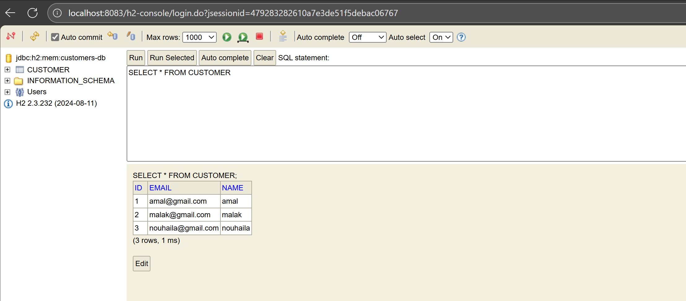
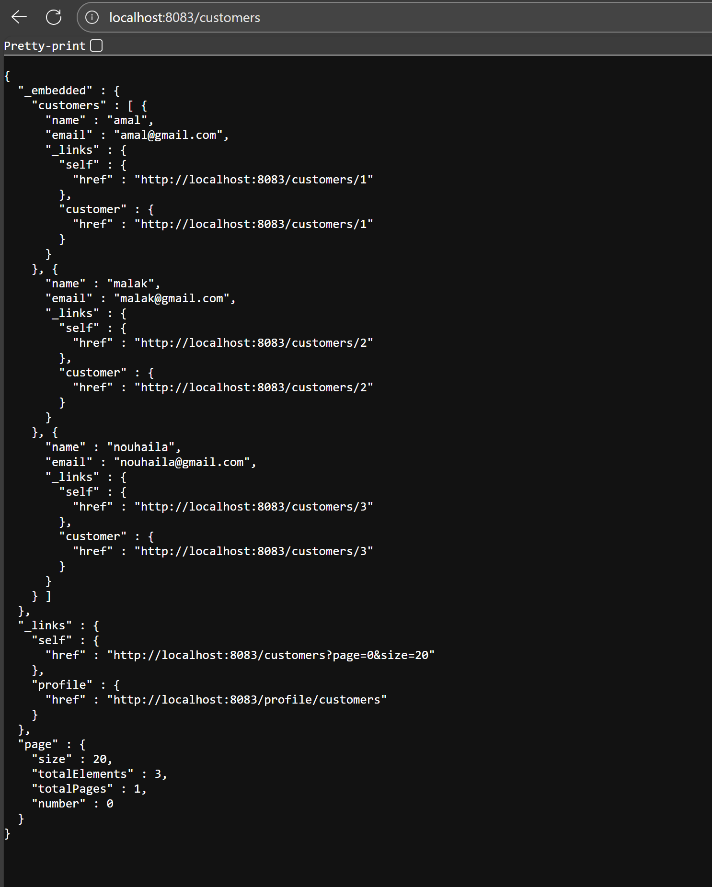
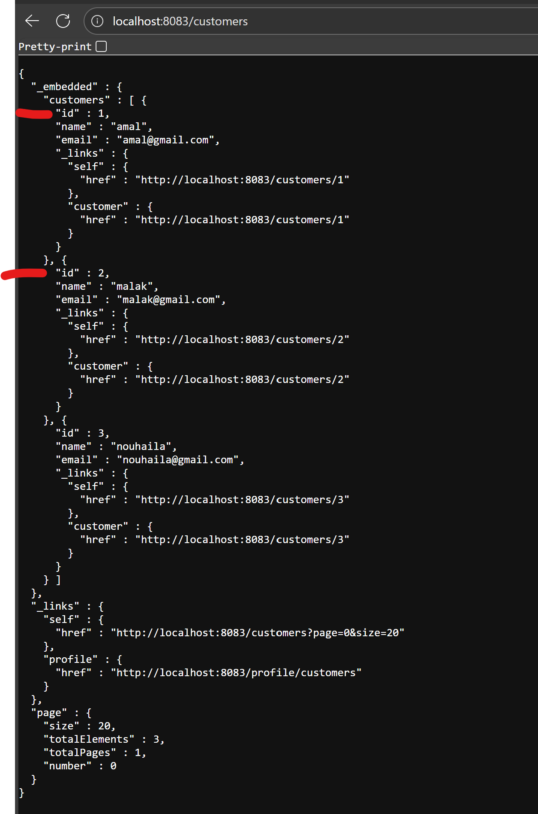
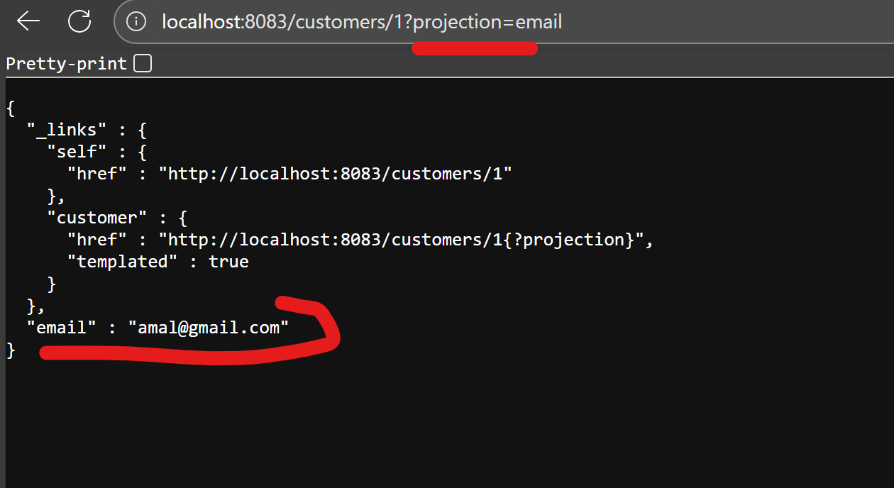
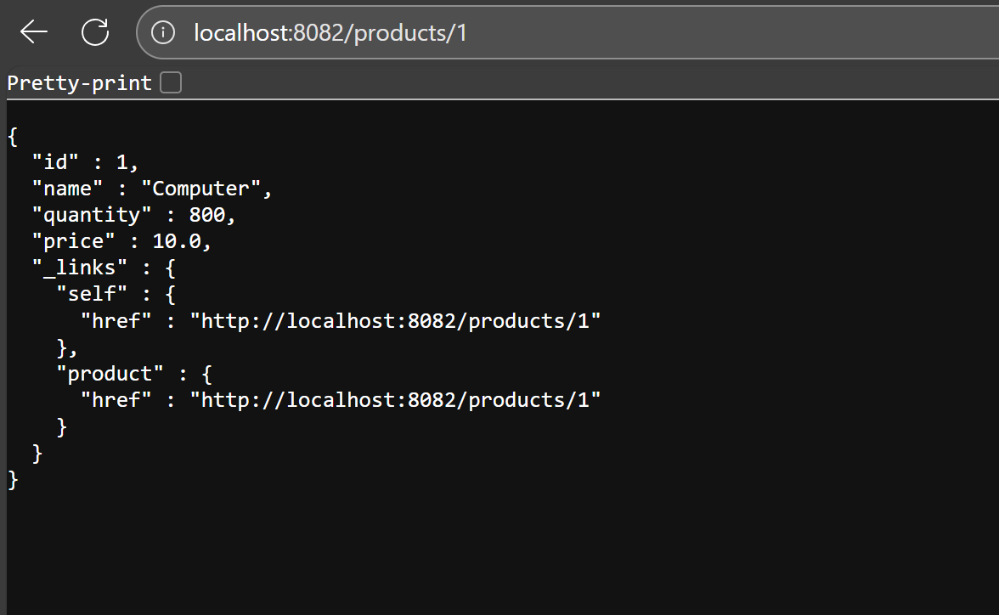
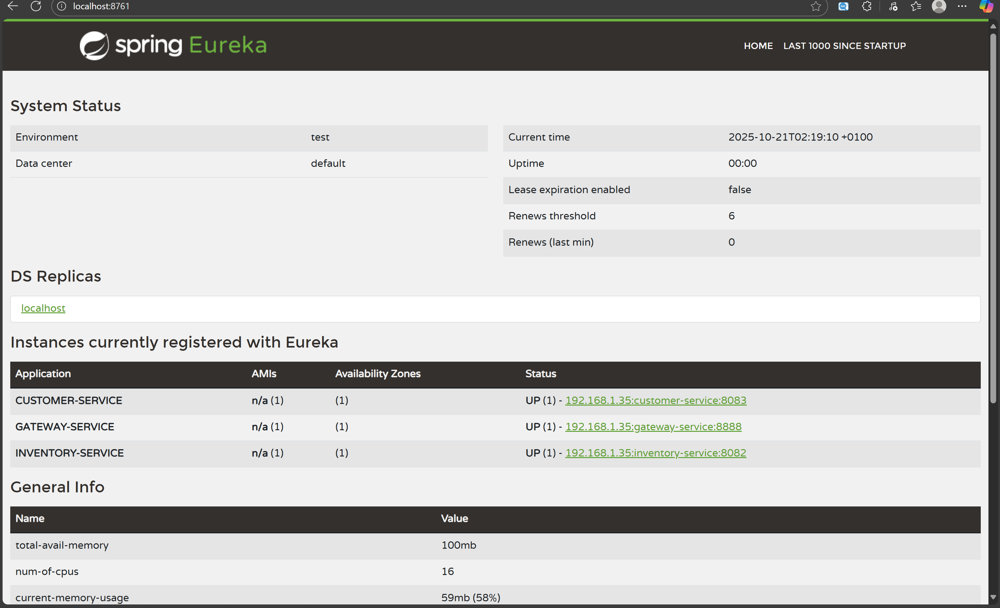
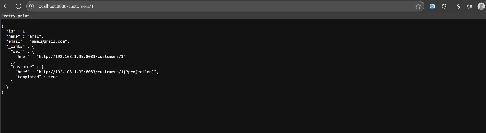
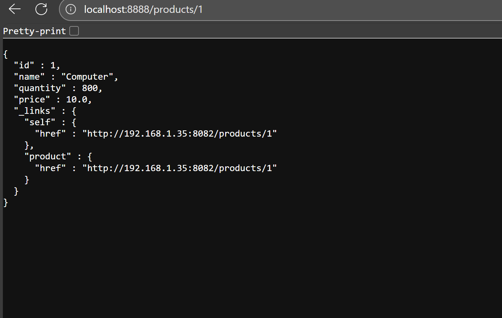
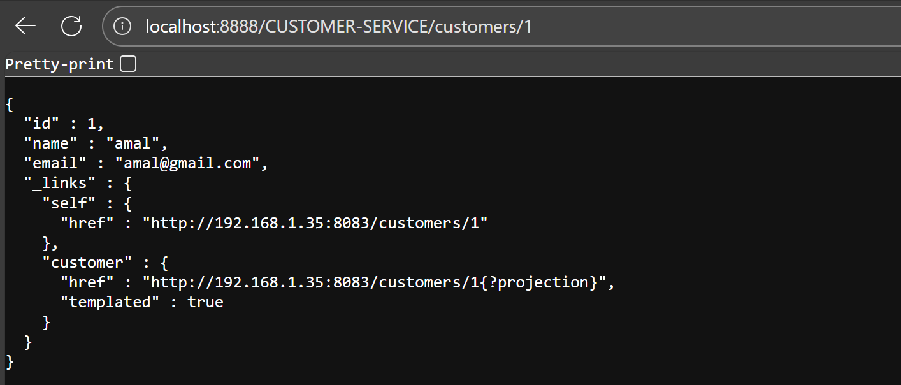

Premier microservice

le /customers c'est le nom de la table donnée par restproperties

on ajoute le dossier config parce que lorsqu'on accède http://localhost:8083/customers on n e voit pas l'id 

le role de la projection c'est d'afficher les champs  qu'on veut uniquement
http://localhost:8083/customers/1?projection=email

2 ème SERVICE
http://localhost:8082/products/1

DIscovery service  on voie tout les services qu'on 'a lié
http://localhost:8761/

le chemin après configuration de discovery

partie de routage dynamique

